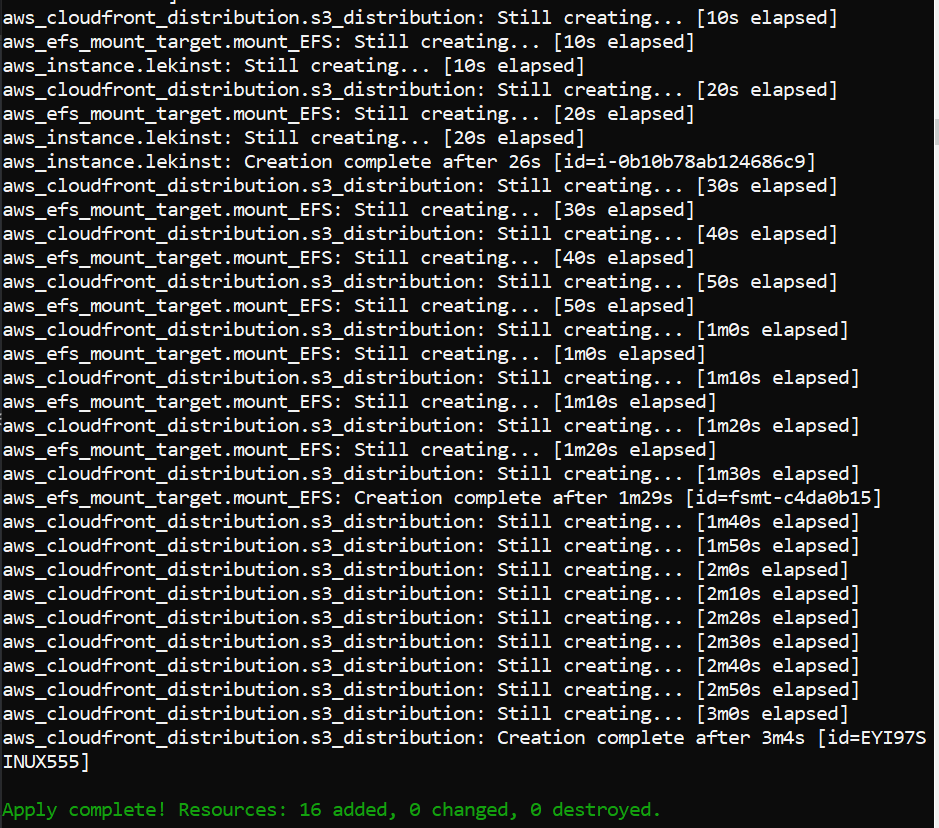

# EFS
DEPLOYMENT OF EFS ON AWS
## Have to create/launch Application using Terraform 
## _Required Scenarior_ :-
- Create the key and security group which allow the port 80.

- Launch EC2 instance.

- In this Ec2 instance use the key and security group which we have created in step 1.

- Launch one Volume using the EFS service and attach it in your vpc, then mount that volume into /var/www/html
 
- Developer have uploaded the code into github repo also the repo has some images.

- Copy the GitHub repo code into /var/www/html

- Create S3 bucket, and copy/deploy the images from github repo into the s3 bucket and change the permission to public readable.

- Create a Cloudfront using s3 bucket(which contains images) and use the Cloudfront URL to update in code in /var/www/html

Terraform apply:

## _STEP 1: Here I am using AWS and select the region ap-south-1(Mumbai)_
 Configure the AWS Provider
 
    #---------------------------------selecting our region for instance-----------
    provider "aws" {
    region = "ap-south-1"
    profile = "lekhika"
    }

## _STEP 2: Creating the key pair_ :-
Amazon EC2 uses public key cryptography to encrypt and decrypt login information. Public key cryptography uses a public key to encrypt a piece of data, and then the recipient uses the private key to decrypt the data. The public and private keys are known as a key pair

Here I am creating a new key-pair ..........................

    ################ creating a key pair##########################

    resource "tls_private_key" "privatekey" {
      algorithm   = "RSA"
      rsa_bits  = "4096"
    }

    resource aws_key_pair "key_pair" {
      key_name   = "taskkey1"
      public_key = tls_private_key.privatekey.public_key_openssh
    }

## _STEP 3: Security group_ :-
A security group acts as a virtual firewall for your instance to control incoming and outgoing traffic. Inbound rules control the incoming traffic to your instance, and outbound rules control the outgoing traffic from your instance. When you launch an instance, you can specify one or more security groups; otherwise, Amazon EC2 uses the default security group. 

    #----------------------------------creating security group--------------------
        resource "aws_security_group" "security" {
        name = "security"
        description = "allow NFS"
        vpc_id = aws_vpc.my_vpc.id
          ingress {
          description = "SSH"
          from_port = 22
          to_port = 22
          protocol = "tcp"
          cidr_blocks = [ "0.0.0.0/0" ]
          }
          ingress {
          description = "EFS"
          from_port = 2049
          to_port = 2049
          protocol = "tcp"
          cidr_blocks = [ "0.0.0.0/0" ]
          }
          ingress {
          description = "HTTP"
          from_port = 80
          to_port = 80
          protocol = "tcp"
          cidr_blocks = [ "0.0.0.0/0" ]
          }
          egress {
          from_port = 0
          to_port = 0
          protocol = "-1"
          cidr_blocks = ["0.0.0.0/0"]
          }
          tags = {
          Name = "security"
          }
        }
  
 
## _Step 4 : Creating a instance_ :-
Amazon EC2 provides different instance types to enable you to choose the CPU, memory, storage, and networking capacity that you need to run your applications
In this step I have created a instance . And login into the instance and install some softwares....
## _Step 5_:
The null_resource resource implements the standard resource lifecycle but takes no further action.
Here I am mount the volume /var/www/html ,which are creating above into /var/www/html
Copy the github repo code into /var/www/html

    resource "aws_instance" "lekinst" {
        ami = "ami-0447a12f28fddb066"
        instance_type = "t2.micro"
        availability_zone = "ap-south-1a"
        key_name = "taskkey1"
        subnet_id = aws_subnet.vpc_subnet.id
        vpc_security_group_ids = [ aws_security_group.security.id ]
    user_data = <<-EOF
          #!/bin/bash
          sleep 5m
          sudo su - root
          # Install AWS EFS Utilities
          yum install -y amazon-efs-utils
          # Mount EFS
          mkdir /efs
          efs_id="${aws_efs_file_system.new_efs.id}"
          mount -t efs "${aws_efs_file_system.new_efs.id}":/ /var/www/html
          # Edit fstab so EFS automatically loads on reboot
          echo $efs_id:/ /efs efs defaults,_netdev 0 0 >> /etc/fstab
          sudo yum install httpd -y
          sudo systemctl start httpd
          sudo systemctl enable httpd
          sudo yum install git -y
       git clone https://github.com/lekhika13/awscloud.git
    EOF
    tags = {
    Name = "lekinst"
    }
   }

Here we also see in AWS Dashboard the instance has created ....

## What is EFS (Elastic File System)??? 🤔🤔
### Amazon Elastic File System (Amazon EFS) provides a simple, scalable, fully managed elastic NFS file system for use with AWS Cloud services and on-premises resources. It is built to scale on demand to petabytes without disrupting applications, growing and shrinking automatically as you add and remove files, eliminating the need to provision and manage capacity to accommodate growth.Amazon EFS is designed to provide massively parallel shared access to thousands of Amazon EC2 instances, enabling your applications to achieve high levels of aggregate throughput and IOPS with consistent low latencies.
Here I am going to create EFS....

    #------------------------------------------launching eFS volume---------------
    resource "aws_efs_file_system" "new_efs" {
    creation_token = "efs"
    tags = {
    Name = "efs_vloume"
    }
    }
    resource "aws_efs_mount_target" "mount_EFS" {
    file_system_id = aws_efs_file_system.new_efs.id
    subnet_id = aws_subnet.vpc_subnet.id
    security_groups = [ aws_security_group.security.id ]
    }

### For accessing EFS we have to create a vpc nd a subnet in it
    
    #------------------------------------------launching vpc------------------------------------------------------------------------
    resource "aws_vpc" "my_vpc" {
      cidr_block       = "192.168.0.0/16"
      enable_dns_support = "true"
      enable_dns_hostnames = "true"
      instance_tenancy = "default"

      tags = {
        Name = "lekhikavpc"
    }
      }

    resource "aws_subnet" "vpc_subnet" {
      vpc_id     = "${aws_vpc.my_vpc.id}"
      cidr_block = "192.168.1.0/24"
      map_public_ip_on_launch = "true"
      availability_zone = "ap-south-1a"
      tags = {
        Name = "lekhikasub1"

    }
    }
    resource "aws_internet_gateway" "inter_gateway" {
      vpc_id = aws_vpc.my_vpc.id

      tags = {
        Name = "my_ig"
      }
    }

    resource "aws_route_table" "rt_tb" {
      vpc_id = aws_vpc.my_vpc.id

      route {

    gateway_id = aws_internet_gateway.inter_gateway.id
        cidr_block = "0.0.0.0/0"
      }

        tags = {
        Name = "myroute-table"
      }
    }

    resource "aws_route_table_association" "rt_associate" {
      subnet_id      = aws_subnet.vpc_subnet.id
      route_table_id = aws_route_table.rt_tb.id
    }

## _STEP 6: S3 Bucket and code-pipeline_ :-
Here I have created S3 storage
git clone folder
    
    #--------------------------------creating s3----------------------------------
    resource "aws_s3_bucket" "b" {
        bucket = "lekhhikabalti"
        acl    = "private"
        tags = {
        Name = "My bucket"
        }
    }

    locals {
      s3_origin_id = "myS3Origin"
    }

    resource "aws_cloudfront_origin_access_identity" "origin_access_identity" {
      comment = "Some comment"
    }
    resource "aws_instance" "lekinst" {
      ami = "ami-0447a12f28fddb066"
      instance_type = "t2.micro"
      availability_zone = "ap-south-1a"
      key_name = "taskkey1"
      subnet_id = aws_subnet.vpc_subnet.id
        vpc_security_group_ids = [ aws_security_group.security.id ]

      user_data = <<-EOF

         #!/bin/bash
            sleep 5m
            sudo su - root
            # Install AWS EFS Utilities
            yum install -y amazon-efs-utils
            # Mount EFS
            mkdir /efs
            efs_id="${aws_efs_file_system.new_efs.id}"
            mount -t efs "${aws_efs_file_system.new_efs.id}":/ /var/www/html
            # Edit fstab so EFS automatically loads on reboot
            echo $efs_id:/ /efs efs defaults,_netdev 0 0 >> /etc/fstab
            sudo yum install httpd -y
            sudo systemctl start httpd
            sudo systemctl enable httpd
            sudo yum install git -y
         git clone https://github.com/lekhika13/awscloud.git
      EOF
      tags = {
      Name = "lekinst"
      }
    }
    
     #----------------------------------creating code pipeline-------------------
      resource "aws_iam_role" "codepipeline_role" {
        name = "test-role"
        assume_role_policy = <<EOF
      {
        "Version": "2012-10-17",
        "Statement": [
          {
            "Effect": "Allow",
            "Principal": {
              "Service": "codepipeline.amazonaws.com"
            },
            "Action": "sts:AssumeRole"
          }
        ]
      }
      EOF
      }

      resource "aws_iam_role_policy" "codepipeline_policy" {
        name = "codepipeline_policy"
        role = "${aws_iam_role.codepipeline_role.id}"
       policy = <<EOF
      {
        "Version": "2012-10-17",
        "Statement": [
          {
            "Effect":"Allow",
            "Action": [
              "s3:GetObject",
              "s3:GetObjectVersion",
              "s3:GetBucketVersioning",
              "s3:PutObject"
            ],
            "Resource": [
              "${aws_s3_bucket.b.arn}",
              "${aws_s3_bucket.b.arn}/*"
            ]
          },
          {
            "Effect": "Allow",
            "Action": [
              "codebuild:BatchGetBuilds",
              "codebuild:StartBuild"
            ],
            "Resource": "*"
          }
        ]
      }
      EOF
      }

      resource "aws_codepipeline" "codepipeline" {
        name     = "tf-test-pipeline"
        role_arn = "${aws_iam_role.codepipeline_role.arn}"
         artifact_store {
          location = "${aws_s3_bucket.b.bucket}"
          type     = "S3"
        }
         stage {
          name = "Source"
          action {
            name             = "Source"
            category         = "Source"
            owner            = "ThirdParty"
            provider         = "GitHub"
            version          = "1"
            output_artifacts = ["SourceArtifact"]
            configuration = {
              Owner  = "lekhika13"
              Repo   = "awscloud"
              Branch = "master"
          OAuthToken = "********************************"
            }
          }
        }
        stage {
          name = "Deploy"

          action {
            name            = "Deploy"
            category        = "Deploy"
            owner           = "AWS"
            provider        = "S3"
            input_artifacts = ["SourceArtifact"]
            version         = "1"

            configuration = {
              BucketName = "${aws_s3_bucket.b.bucket}"
              Extract = "true"
            }
          }
        }
      }
Here we also see in AWS Dashboard the S3 bucket has created

## _STEP 7:Creating Cloudfront_ :-
Amazon CloudFront is a fast content delivery network (CDN) service that securely delivers data, videos, applications, and APIs to customers globally with low latency, high transfer speeds, all within a developer-friendly environment.
Here I have created a cloudfront distribution and link with S3 bucket.

    #----------------------------------------------creating web distribution---------------------------------------------------------------
    resource "aws_cloudfront_distribution" "s3_distribution" {
          origin {
          domain_name = "${aws_s3_bucket.b.bucket_regional_domain_name}"
          origin_id   = "${local.s3_origin_id}"

          s3_origin_config {
            origin_access_identity = "${aws_cloudfront_origin_access_identity.origin_access_identity.cloudfront_access_identity_path}"
            }
          }
          enabled             = true
          is_ipv6_enabled     = true
          comment             = "Some comment"
          default_cache_behavior {
            allowed_methods  = ["DELETE", "GET", "HEAD", "OPTIONS", "PATCH",      "POST", "PUT"]
            cached_methods   = ["GET", "HEAD"]
            target_origin_id = "${local.s3_origin_id}"
            forwarded_values {
              query_string = false
              cookies {
              forward = "none"
              }
            }

            viewer_protocol_policy = "allow-all"
          }
          restrictions {
          geo_restriction {
            restriction_type = "whitelist"
            locations        = ["US", "CA", "GB", "IN"]
          }
          }
          tags = {
          Environment = "production"
          }
          viewer_certificate {
          cloudfront_default_certificate = true
          }
    }

# Deploye Cloudfront URL in Website:-
Here I am putting the cloudfront url in the webpage index.html into the folder /var/www/html
resource "null_resource" "nullremote2"  {

    depends_on = [

         aws_cloudfront_distribution.s3_distribution,
      ]

      connection {
        type     = "ssh"
        user     = "ec2-user"
        private_key = tls_private_key.privatekey.private_key_pem
        host     = aws_instance.suhaib.public_ip
      }

    provisioner "remote-exec" {
      inline = [
       "sudo su << EOF",
       "echo \"\" >> /var/www/html/3.html",
       "EOF"
      ]
    }
    }
  

 # _THANKYOU! FOR READING_
